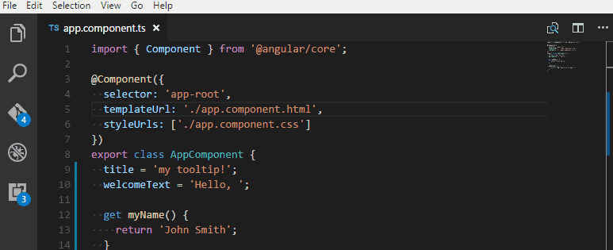

# vscode-angular-support

Language support for angular definitions.

## Prerequisites

- Angular with **Typescript** *(JS version possibly in the future)*
- *At the moment* [official style guide](https://angular.io/docs/ts/latest/guide/style-guide.html#!#naming) file naming (component `.ts` and `.html` names should match).

## Features

Go to / peek definition from:
- interpolation `{{ myVar }}`
- input `[(...)]="myVar"`
- output `(...)="myMethod"`
- `templateUrl` or `styleUrls` in `@Component` decorator

## Roadmap

Go to / peek definition from:
- component `<my-component></my-component>`
- component input `[myInput]=".."` or output `(myOutput)=".."`

## Contributing

Contributions are extremely welcome.  
Read [official extension guide](https://code.visualstudio.com/docs/extensions/overview).

## License

MIT